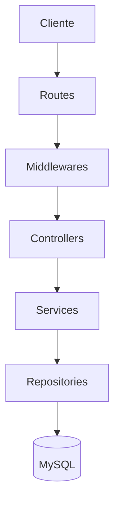
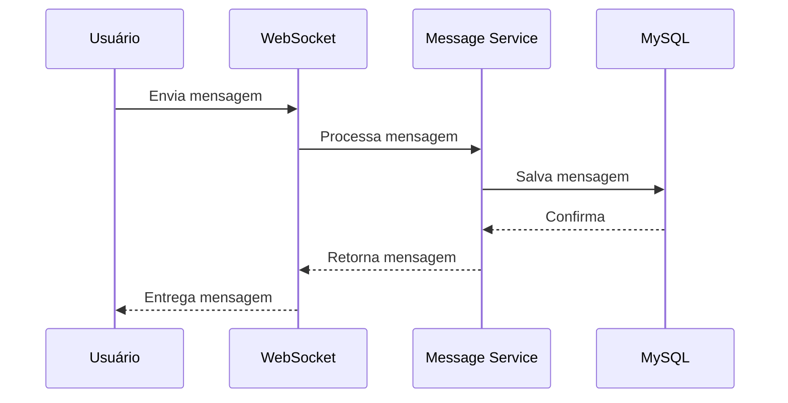
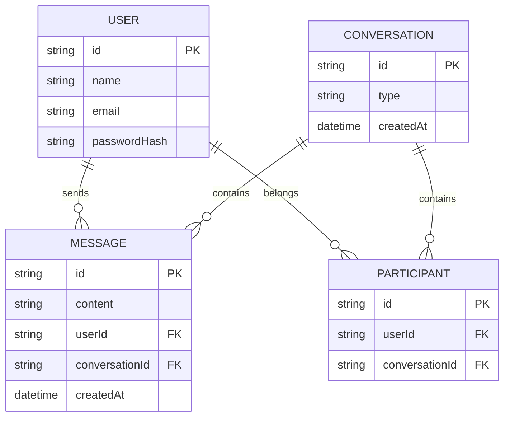

# 💬 ChatFlow

Aplicação de comunicação em tempo real desenvolvida como projeto de estudo aprofundado em **Back-end**, com foco em **TypeScript**, **Programação Orientada a Objetos**, **SOLID**, **Clean Code** e arquitetura escalável.

> 🚧 Projeto em desenvolvimento ativo.  
> Este README funciona como mapa do projeto e será atualizado conforme novas funcionalidades forem implementadas.

---

## 📚 Índice

- [Sobre o projeto](#-sobre-o-projeto)
- [Objetivos](#-objetivos-do-projeto)
- [Stack utilizada](#-stack-utilizada)
- [Arquitetura](#-arquitetura)
- [Fluxo da aplicação](#-fluxo-da-aplicação)
- [Modelagem do banco](#-modelagem-do-banco-de-dados)
- [Estrutura de pastas](#-estrutura-de-pastas)
- [Módulos do sistema](#-módulos-do-sistema)
- [Segurança](#-segurança)
- [Como executar](#-como-executar-o-projeto)
- [API Documentation](#-api-documentation)
- [Roadmap](#-roadmap)
- [Padrões utilizados](#-padrões-utilizados)
- [Decisões técnicas](#-decisões-técnicas)
- [Autor](#-autor)

---

## 📖 Sobre o projeto

O **ChatFlow** é uma aplicação de conversação em tempo real onde usuários podem criar contas, autenticar-se e trocar mensagens instantaneamente.

O objetivo principal deste projeto não é apenas criar um chat funcional, mas construir uma aplicação seguindo padrões utilizados no mercado de desenvolvimento de Software.

---

## 🧠 Conceitos aplicados

Durante o desenvolvimento do ChatFlow serão aplicados conceitos e práticas utilizadas no desenvolvimento de sistemas profissionais:

- **Arquitetura em camadas**
  - Separação de responsabilidades entre Controllers, Services, Repositories e Entities.

- **Programação Orientada a Objetos (POO)**
  - Uso de classes, objetos, encapsulamento, abstração, herança e polimorfismo para organização do domínio da aplicação.

- **Princípios SOLID**
  - Aplicação dos cinco princípios para criar um código mais flexível, testável e de fácil manutenção.

- **Clean Code**
  - Desenvolvimento com foco em legibilidade, simplicidade e clareza.

- **Clean Architecture**
  - Organização do sistema visando baixo acoplamento e independência das regras de negócio.

- **Design Patterns**
  - Utilização de padrões de projeto para resolver problemas comuns de arquitetura e desenvolvimento.

- **Domain-Driven Design (DDD)**
  - Modelagem do sistema baseada nas regras e conceitos do domínio da aplicação.

- **Dependency Injection (DI)**
  - Gerenciamento de dependências para reduzir acoplamento entre componentes.

- **Repository Pattern**
  - Abstração do acesso aos dados, isolando regras de negócio da camada de persistência.

- **Service Layer Pattern**
  - Centralização das regras de negócio em serviços independentes.

- **DTO (Data Transfer Object)**
  - Controle e organização dos dados que trafegam entre as camadas da aplicação.

- **Validação de dados**
  - Garantia de integridade das informações recebidas pela API.

- **Tratamento global de erros**
  - Padronização das respostas de erro e melhor experiência para consumidores da API.

- **Autenticação e autorização**
  - Implementação de mecanismos seguros para controle de acesso.

- **Segurança da aplicação**
  - Aplicação de boas práticas contra vulnerabilidades comuns.

- **Testes automatizados**
  - Criação de testes unitários e testes de integração para garantir confiabilidade.

- **Versionamento de código**
  - Uso de Git seguindo boas práticas de organização e histórico de alterações.

- **Documentação de software**
  - Criação de documentação técnica utilizando README e Swagger.

- **Código limpo e sustentável**
  - Desenvolvimento pensando em manutenção, evolução e escalabilidade.

- **Escalabilidade**
  - Preparação da aplicação para suportar crescimento de usuários e volume de dados.

- **Observabilidade**
  - Planejamento de logs, monitoramento e rastreamento de erros.

- **Performance**
  - Aplicação de técnicas para otimização de consultas, cache e processamento.

- **Desenvolvimento orientado a boas práticas**
  - Construção do sistema seguindo padrões utilizados no mercado.

# 🛠 Stack utilizada

## Back-end

- [Node.js](https://nodejs.org/) — Ambiente de execução JavaScript no servidor.

- [TypeScript](https://www.typescriptlang.org/) — Superset do JavaScript com tipagem estática, proporcionando maior segurança e organização do código.

- [Express 4](https://expressjs.com/) — Framework utilizado para construção da API HTTP e gerenciamento das rotas da aplicação.

- [MySQL](https://www.mysql.com/) — Banco de dados relacional utilizado para armazenamento das informações da aplicação.

- [ORM](https://www.prisma.io/) — Camada de abstração para comunicação entre a aplicação e o banco de dados.

- [WebSocket](https://developer.mozilla.org/en-US/docs/Web/API/WebSockets_API) — Tecnologia utilizada para comunicação bidirecional em tempo real entre clientes e servidor.

- [Redis](https://redis.io/) — Banco de dados em memória utilizado para cache, gerenciamento de presença dos usuários e recursos de tempo real.

- [JSON Web Token (JWT)](https://jwt.io/) — Sistema de autenticação baseado em tokens para controle de acesso.

- [bcrypt](https://www.npmjs.com/package/bcrypt) — Biblioteca utilizada para criação de hashes seguros de senha.

- [Zod](https://zod.dev/) — Biblioteca utilizada para validação e tipagem dos dados recebidos pela aplicação.

- [Docker](https://www.docker.com/) — Plataforma utilizada para criação de ambientes isolados e padronização da infraestrutura.

- [Swagger](https://swagger.io/) — Ferramenta utilizada para documentação e testes dos endpoints da API.

---

## Front-end *(planejado)*

- [React](https://react.dev/) — Biblioteca utilizada para construção da interface da aplicação.

- [TypeScript](https://www.typescriptlang.org/) — Utilizado também no frontend para garantir maior segurança e organização do código.

- [Tailwind CSS](https://tailwindcss.com/) — Framework CSS utilizado para criação da interface de forma rápida e responsiva.

- [Vite](https://vite.dev/) — Ferramenta utilizada para configuração e execução do ambiente frontend.

---

## Qualidade de código

- [ESLint](https://eslint.org/) — Análise estática do código para identificar problemas e manter padrões.

- [Prettier](https://prettier.io/) — Formatação automática do código seguindo um padrão definido.

- **Clean Code** — Práticas para criação de código legível, simples e sustentável.

- **SOLID** — Princípios de engenharia de software para criar código flexível e de fácil manutenção.

- **Programação Orientada a Objetos (POO)** — Paradigma utilizado para organização das entidades e regras do domínio.

- **Clean Architecture** — Organização estrutural visando baixo acoplamento e separação de responsabilidades.

---

## Testes automatizados

- [Jest](https://jestjs.io/) — Framework utilizado para criação de testes automatizados.

- [Supertest](https://www.npmjs.com/package/supertest) — Biblioteca utilizada para testar endpoints HTTP da API.

---

## Ferramentas de desenvolvimento

- [Git](https://git-scm.com/) — Controle de versão do projeto.

- [GitHub](https://github.com/) — Hospedagem do repositório e gerenciamento do código.

- [VS Code](https://code.visualstudio.com/) — Editor utilizado no desenvolvimento.

# 🏗 Arquitetura

O projeto utiliza arquitetura baseada em camadas.

Cada camada possui uma responsabilidade específica.



---

## Responsabilidade das camadas

### Routes

Responsável pelos endpoints da aplicação.

Exemplo:

```
POST /login
GET /messages
```

---

### Controllers

Responsável por:

- receber requisições;
- chamar serviços;
- retornar respostas.

---

### Services

Responsável pelas regras de negócio.

Exemplo:

- validar envio de mensagem;
- verificar permissões;
- processar operações.

---

### Repository

Responsável pelo acesso aos dados.

Exemplo:

- salvar mensagem;
- buscar usuário;
- consultar conversas.

---

# 🔄 Fluxo de mensagem em tempo real



---

# 🗃 Modelagem do banco de dados

Principais entidades:

- User
- Conversation
- Participant
- Message




---

# 📂 Estrutura de pastas

```
backend
│
└── src
    │
    ├── config
    │
    ├── modules
    │   │
    │   ├── auth
    │   ├── users
    │   ├── conversations
    │   └── messages
    │
    ├── shared
    │
    ├── middlewares
    │
    ├── errors
    │
    ├── routes
    │
    └── websocket
```

---

# 📦 Módulos do sistema

## Autenticação

- [ ] Cadastro de usuário
- [ ] Login
- [ ] JWT
- [ ] Refresh Token
- [ ] Middleware de autenticação


## Usuários

- [ ] Perfil
- [ ] Atualização de dados
- [ ] Status online


## Conversas

- [ ] Criar conversa
- [ ] Conversa privada
- [ ] Participantes


## Mensagens

- [ ] Enviar mensagem
- [ ] Histórico
- [ ] Paginação
- [ ] Eventos em tempo real


## WebSocket

- [ ] Conexão em tempo real
- [ ] Eventos
- [ ] Notificações
- [ ] Controle de usuários online

---

# 🔐 Segurança

O projeto utilizará:

- JWT para autenticação;
- bcrypt para senhas;
- validação de dados;
- tratamento global de erros;
- controle de permissões.

---

# 🚀 Como executar o projeto

## Clonar o projeto

```bash
git clone projeto
```

## Entrar no backend

```bash
cd backend
```

## Instalar dependências

```bash
npm install
```

## Executar ambiente de desenvolvimento

```bash
npm run dev
```

---

# 📘 API Documentation

A documentação da API será criada utilizando Swagger.

Futuramente:

```
/api-docs
```

---

# 🧠 Padrões utilizados

## SOLID

Aplicação dos cinco princípios:

- Single Responsibility Principle;
- Open Closed Principle;
- Liskov Substitution Principle;
- Interface Segregation Principle;
- Dependency Inversion Principle.


## Clean Code

Práticas utilizadas:

- nomes claros;
- funções pequenas;
- responsabilidades bem definidas;
- baixo acoplamento.

---

# 💡 Decisões técnicas

## Por que TypeScript?

Porque aumenta a segurança do código através da tipagem estática.

---

## Por que Express?

Porque permite entender profundamente o funcionamento de APIs HTTP.

---

## Por que MySQL?

Porque é um banco relacional amplamente utilizado no mercado.

---

## Por que Programação Orientada a Objetos?

Para organizar o domínio da aplicação através de objetos e responsabilidades bem definidas.

---

## Por que SOLID?

Para criar um código:

- escalável;
- testável;
- fácil de manter.

---

## 🗺 Roadmap

O desenvolvimento do ChatFlow será dividido em fases, seguindo uma evolução gradual de uma aplicação backend profissional.

Cada etapa será marcada conforme for concluída.

---

## ✅ Fase 1 — Configuração inicial do projeto

- [x] Criar estrutura inicial do projeto
- [x] Configurar Node.js
- [x] Configurar TypeScript
- [x] Configurar ESM (`type: module`)
- [x] Configurar Express
- [x] Configurar ESLint
- [x] Configurar Prettier
- [x] Configurar Git e versionamento
- [x] Criar documentação inicial do projeto (README)

---

## 🏗 Fase 2 — Arquitetura e organização do Backend

- [ ] Criar estrutura de módulos
- [ ] Implementar arquitetura em camadas
  - [ ] Controllers
  - [ ] Services
  - [ ] Repositories
  - [ ] Entities
- [ ] Aplicar Programação Orientada a Objetos
- [ ] Aplicar princípios SOLID
- [ ] Criar tratamento global de erros
- [ ] Criar padrões de respostas da API
- [ ] Configurar variáveis de ambiente

---

## 🗄 Fase 3 — Banco de dados e persistência

- [ ] Configurar MySQL
- [ ] Configurar ORM
- [ ] Criar conexão com banco
- [ ] Criar migrations
- [ ] Criar modelagem inicial

### Entidades:

- [ ] User
- [ ] Conversation
- [ ] Participant
- [ ] Message

- [ ] Criar relacionamentos entre entidades
- [ ] Criar repositories para acesso aos dados

---

## 🔐 Fase 4 — Sistema de autenticação e usuários

- [ ] Criar cadastro de usuários
- [ ] Implementar hash de senha com bcrypt
- [ ] Criar login
- [ ] Implementar autenticação JWT
- [ ] Criar middleware de autenticação
- [ ] Criar refresh token
- [ ] Criar gerenciamento de sessão
- [ ] Criar perfil de usuário

---

## 💬 Fase 5 — Sistema de conversas

- [ ] Criar criação de conversas
- [ ] Implementar conversas privadas
- [ ] Implementar participantes
- [ ] Listar conversas do usuário
- [ ] Gerenciar membros da conversa

---

## ⚡ Fase 6 — Comunicação em tempo real

- [ ] Configurar WebSocket
- [ ] Criar servidor de comunicação em tempo real
- [ ] Criar eventos de mensagens
- [ ] Enviar mensagens instantaneamente
- [ ] Receber mensagens em tempo real
- [ ] Criar status online/offline
- [ ] Criar indicador de usuário digitando
- [ ] Criar notificações em tempo real

---

## 🚀 Fase 7 — Performance e escalabilidade

- [ ] Implementar Redis
- [ ] Criar sistema de cache
- [ ] Gerenciar presença dos usuários
- [ ] Criar filas de processamento
- [ ] Melhorar performance das consultas
- [ ] Preparar aplicação para múltiplas instâncias

---

## 🧪 Fase 8 — Testes automatizados

- [ ] Configurar ambiente de testes
- [ ] Testes unitários
- [ ] Testes de integração
- [ ] Testes de autenticação
- [ ] Testes de mensagens
- [ ] Testes dos serviços principais

---

## 📚 Fase 9 — Documentação da API

- [ ] Configurar Swagger
- [ ] Documentar endpoints
- [ ] Documentar autenticação
- [ ] Documentar respostas da API
- [ ] Criar exemplos de requisições

---

## 🐳 Fase 10 — Infraestrutura e Deploy

- [ ] Configurar Docker
- [ ] Criar Docker Compose
- [ ] Containerizar aplicação
- [ ] Configurar banco em produção
- [ ] Configurar variáveis de ambiente
- [ ] Deploy do backend
- [ ] Deploy do frontend

---

## 🎨 Fase 11 — Front-end (futuro)

- [ ] Criar aplicação React
- [ ] Configurar Tailwind CSS
- [ ] Criar tela de login
- [ ] Criar cadastro de usuário
- [ ] Criar interface de conversas
- [ ] Integrar API
- [ ] Integrar WebSocket
- [ ] Criar notificações visuais

---

## 📐 Convenções e padrões

### Commits

Este projeto segue a convenção [Conventional Commits](https://www.conventionalcommits.org/pt-br/v1.0.0/), facilitando a leitura do histórico e a identificação do tipo de cada mudança:

| Prefixo | Uso |
|---------|-----|
| `feat:` | Nova funcionalidade |
| `fix:` | Correção de bug |
| `refactor:` | Reorganização de código sem mudar comportamento |
| `docs:` | Mudanças na documentação |
| `chore:` | Configuração, tarefas de manutenção |
| `test:` | Adição ou ajuste de testes |

---

# 👨‍💻 Autor

Desenvolvido por **José Lucas**.

Projeto criado com objetivo de aprendizado e evolução profissional na área de desenvolvimento backend.