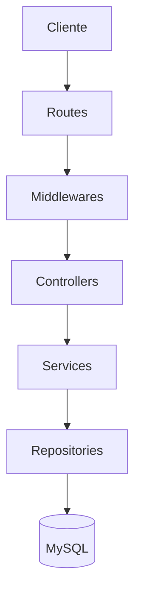
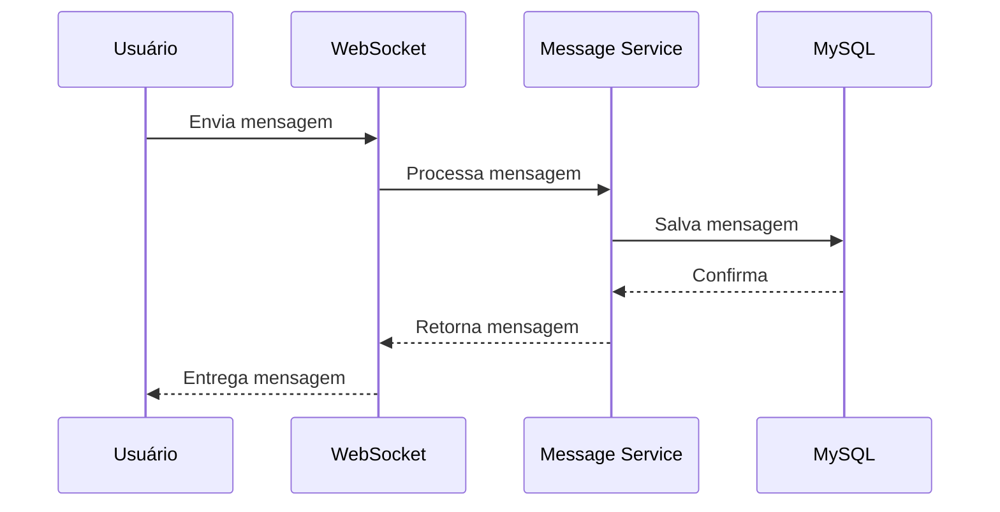
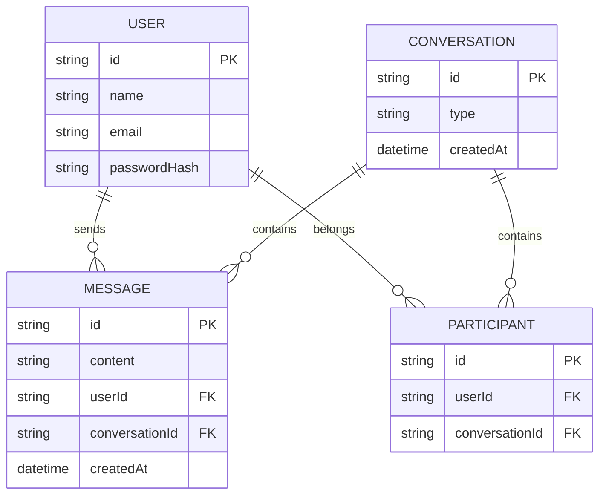

# 💬 ChatFlow


Aplicação de comunicação em tempo real desenvolvida com foco em **Engenharia de Software**, utilizando TypeScript, Programação Orientada a Objetos, princípios SOLID, Clean Code e arquitetura escalável.

---

## 📚 Índice

- [Sobre o projeto](#-sobre-o-projeto)
- [Conceitos aplicados](#-conceitos-aplicados)
- [Stack utilizada](#-stack-utilizada)
- [Arquitetura](#-arquitetura)
- [Fluxo de mensagem em tempo real](#-fluxo-de-mensagem-em-tempo-real)
- [Modelagem do banco de dados](#-modelagem-do-banco-de-dados)
- [Estrutura de pastas](#-estrutura-de-pastas)
- [Segurança](#-segurança)
- [Como executar](#-como-executar-o-projeto)
- [API Documentation](#-api-documentation)
- [Roadmap](#-roadmap)
- [Convenções](#-convenções-e-padrões)
- [Autor](#-autor)

---

## 🎯 Objetivo do projeto

O ChatFlow tem como objetivo desenvolver uma aplicação **Full Stack** completa aplicando conceitos utilizados no mercado.

Durante o desenvolvimento serão explorados:

- construção de APIs REST;
- comunicação em tempo real;
- arquitetura escalável;
- segurança;
- persistência de dados;
- testes automatizados;
- boas práticas de engenharia de software.

---

## 🧠 Conceitos aplicados

<table>
<tr><td><strong>Arquitetura</strong></td><td>Layered Architecture · Clean Architecture · DDD · Repository Pattern · Service Layer · Dependency Injection · Design Patterns</td></tr>
<tr><td><strong>Qualidade de código</strong></td><td>SOLID · Clean Code · DTO · Programação Orientada a Objetos</td></tr>
<tr><td><strong>Confiabilidade</strong></td><td>Validação de dados · Tratamento global de erros · Testes unitários e de integração</td></tr>
<tr><td><strong>Segurança</strong></td><td>Autenticação e autorização · Boas práticas contra vulnerabilidades comuns</td></tr>
<tr><td><strong>Operação</strong></td><td>Observabilidade · Cache · Escalabilidade horizontal · Performance</td></tr>
<tr><td><strong>Processo</strong></td><td>Versionamento com Git · Conventional Commits · Documentação técnica (README + Swagger)</td></tr>
</table>

---

## 🛠 Stack utilizada

| Categoria | Tecnologias |
|---|---|
| **Runtime / Linguagem** | Node.js, TypeScript |
| **Framework HTTP** | Express 4 |
| **Banco de dados** | MySQL + Prisma (ORM) |
| **Tempo real** | WebSocket, Redis (cache e presença) |
| **Autenticação** | JWT, bcrypt |
| **Validação** | Zod |
| **Infraestrutura** | Docker |
| **Documentação de API** | Swagger |
| **Qualidade** | ESLint, Prettier |
| **Testes** | Jest, Supertest |
| **Ferramentas** | Git, GitHub, VS Code, Postman |

<details>
<summary><strong>Front-end (planejado)</strong></summary>

React · TypeScript · Tailwind CSS · Vite

</details>

---

## 🏗 Arquitetura

Arquitetura em camadas, cada uma com responsabilidade única:



| Camada | Responsabilidade |
|---|---|
| **Routes** | Define os endpoints (`POST /login`, `GET /messages`) |
| **Controllers** | Recebe requisições, chama serviços e retorna respostas |
| **Services** | Regras de negócio (validações, permissões, processamento) |
| **Repositories** | Acesso aos dados (salvar mensagem, buscar usuário, consultar conversas) |

---

## 🔄 Fluxo de mensagem em tempo real



---

## 🗃 Modelagem do banco de dados

Entidades principais: `User`, `Conversation`, `Participant`, `Message`.



---

## 📂 Estrutura de pastas

```
backend
└── src
    ├── config
    ├── modules
    │   ├── auth
    │   ├── users
    │   ├── conversations
    │   └── messages
    ├── shared
    ├── middlewares
    ├── errors
    ├── routes
    └── websocket
```

---

## 🔐 Segurança

- JWT para autenticação
- bcrypt para hash de senhas
- Validação de dados de entrada
- Tratamento global de erros
- Controle de permissões

---

## 🚀 Como executar o projeto

```bash
git clone <url-do-repositorio>
cd chatflow/backend
npm install
npm run dev
```

---

## 📘 API Documentation

Documentação via Swagger, disponível futuramente em:

```
/api-docs
```

---

## 🗺 Roadmap

<details>
<summary><strong>✅ Fase 1 — Configuração inicial</strong> (concluída)</summary>

- [x] Estrutura inicial do projeto
- [x] Node.js, TypeScript, ESM
- [x] Express, ESLint, Prettier
- [x] Git e documentação inicial

</details>

<details>
<summary><strong>🏗 Fase 2 — Arquitetura e organização do backend</strong> (em andamento)</summary>

- [ ] Estrutura de módulos
- [ ] Controllers, Services, Repositories, Entities
- [ ] Programação Orientada a Objetos + SOLID
- [ ] Tratamento global de erros
- [ ] Padrão de respostas da API
- [ ] Variáveis de ambiente

</details>

<details>
<summary><strong>🗄 Fase 3 — Banco de dados e persistência</strong></summary>

- [ ] Configurar MySQL + ORM
- [ ] Migrations e modelagem inicial
- [ ] Entidades: User, Conversation, Participant, Message
- [ ] Relacionamentos e repositories

</details>

<details>
<summary><strong>🔐 Fase 4 — Autenticação e usuários</strong></summary>

- [ ] Cadastro e login
- [ ] Hash de senha (bcrypt) e JWT
- [ ] Middleware de autenticação, refresh token, sessão
- [ ] Perfil de usuário

</details>

<details>
<summary><strong>💬 Fase 5 — Sistema de conversas</strong></summary>

- [ ] Criação de conversas privadas e participantes
- [ ] Listagem de conversas do usuário
- [ ] Gerenciamento de membros

</details>

<details>
<summary><strong>⚡ Fase 6 — Comunicação em tempo real</strong></summary>

- [ ] Servidor WebSocket e eventos de mensagens
- [ ] Envio/recebimento instantâneo
- [ ] Status online/offline e "digitando..."
- [ ] Notificações em tempo real

</details>

<details>
<summary><strong>🚀 Fase 7 — Performance e escalabilidade</strong></summary>

- [ ] Redis para cache e presença
- [ ] Filas de processamento
- [ ] Otimização de consultas
- [ ] Suporte a múltiplas instâncias

</details>

<details>
<summary><strong>🧪 Fase 8 — Testes automatizados</strong></summary>

- [ ] Testes unitários e de integração
- [ ] Testes de autenticação e mensagens

</details>

<details>
<summary><strong>📚 Fase 9 — Documentação da API</strong></summary>

- [ ] Swagger configurado e endpoints documentados
- [ ] Exemplos de requisições

</details>

<details>
<summary><strong>🐳 Fase 10 — Infraestrutura e Deploy</strong></summary>

- [ ] Docker + Docker Compose
- [ ] Banco em produção e variáveis de ambiente
- [ ] Deploy backend e frontend

</details>

<details>
<summary><strong>🎨 Fase 11 — Front-end</strong></summary>

- [ ] React + Tailwind CSS
- [ ] Telas de login, cadastro e conversas
- [ ] Integração com API e WebSocket
- [ ] Notificações visuais

</details>

---

## 📐 Convenções e padrões

Commits seguem [Conventional Commits](https://www.conventionalcommits.org/pt-br/v1.0.0/):

| Prefixo | Uso |
|---|---|
| `feat:` | Nova funcionalidade |
| `fix:` | Correção de bug |
| `refactor:` | Reorganização sem mudar comportamento |
| `docs:` | Mudanças na documentação |
| `chore:` | Configuração e manutenção |
| `test:` | Adição ou ajuste de testes |

---

## 👤 Autor

Desenvolvido por **José Lucas** — projeto de aprendizado e evolução profissional em desenvolvimento de software.