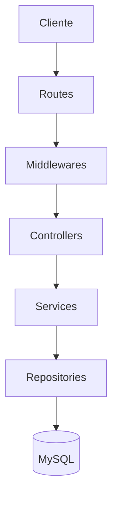
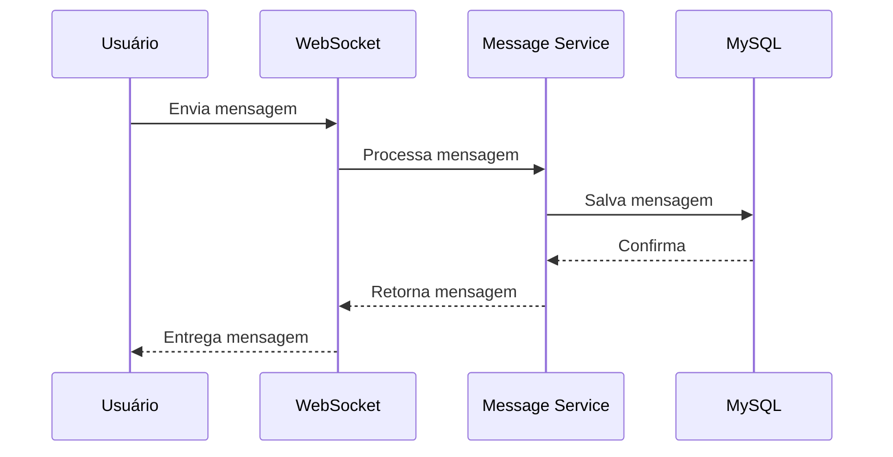
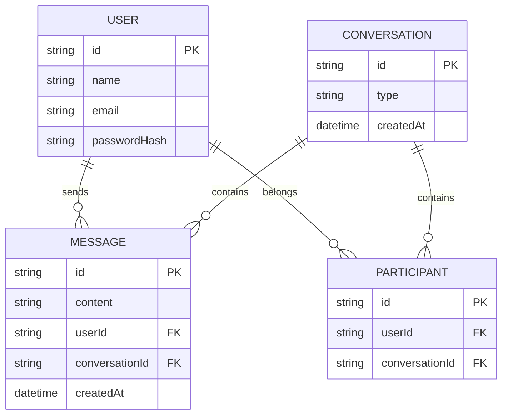

# 💬 ChatFlow

Aplicação de comunicação em tempo real desenvolvida como projeto de estudo aprofundado em **Back-end**, com foco em **TypeScript**, **Programação Orientada a Objetos**, **SOLID**, **Clean Code** e arquitetura escalável.

> 🚧 Projeto em desenvolvimento ativo.  
> Este README funciona como mapa do projeto e será atualizado conforme novas funcionalidades forem implementadas.

---

# 📚 Índice

- [Sobre o projeto](#-sobre-o-projeto)
- [Objetivos](#-objetivos-do-projeto)
- [Stack utilizada](#-stack-utilizada)
- [Arquitetura](#-arquitetura)
- [Fluxo da aplicação](#-fluxo-da-aplicação)
- [Modelagem do banco](#-modelagem-do-banco-de-dados)
- [Estrutura de pastas](#-estrutura-de-pastas)
- [Módulos do sistema](#-módulos-do-sistema)
- [Segurança](#-segurança)
- [Como executar](#-como-executar-o-projeto)
- [API Documentation](#-api-documentation)
- [Roadmap](#-roadmap)
- [Padrões utilizados](#-padrões-utilizados)
- [Decisões técnicas](#-decisões-técnicas)
- [Autor](#-autor)

---

# 📖 Sobre o projeto

O **ChatFlow** é uma aplicação de conversação em tempo real onde usuários podem criar contas, autenticar-se e trocar mensagens instantaneamente.

O objetivo principal deste projeto não é apenas criar um chat funcional, mas construir uma aplicação seguindo padrões utilizados no mercado de desenvolvimento backend.

Durante o desenvolvimento serão aplicados:

- Arquitetura em camadas;
- Programação Orientada a Objetos;
- Princípios SOLID;
- Clean Code;
- Testes automatizados;
- Segurança;
- Boas práticas de desenvolvimento.

---

# 🎯 Objetivos do projeto

Este projeto tem como objetivo aprofundar conhecimentos em desenvolvimento backend profissional.

## Progresso geral

- [x] Criar projeto inicial
- [x] Configurar Node.js
- [x] Configurar TypeScript
- [x] Configurar Express
- [x] Configurar Git
- [x] Configurar ESLint
- [x] Configurar Prettier

- [ ] Criar arquitetura de módulos
- [ ] Implementar Programação Orientada a Objetos
- [ ] Aplicar SOLID
- [ ] Configurar MySQL
- [ ] Criar autenticação
- [ ] Criar comunicação em tempo real
- [ ] Implementar WebSocket
- [ ] Implementar Redis
- [ ] Criar testes
- [ ] Criar documentação Swagger
- [ ] Criar ambiente Docker

---

# 🛠 Stack utilizada

## Back-end

- **Node.js**
  - Ambiente de execução JavaScript.

- **TypeScript**
  - Tipagem estática e maior segurança no desenvolvimento.

- **Express 4**
  - Framework utilizado para criação da API HTTP.

- **MySQL**
  - Banco de dados relacional.

- **ORM**
  - Camada responsável pela comunicação entre aplicação e banco.

- **WebSocket**
  - Comunicação em tempo real entre clientes.

- **Redis**
  - Cache, gerenciamento de presença e recursos de tempo real.

- **JWT**
  - Autenticação baseada em tokens.

- **bcrypt**
  - Hash seguro de senhas.

- **Zod**
  - Validação dos dados recebidos.

- **Docker**
  - Containerização do ambiente.

- **Swagger**
  - Documentação da API.

---

## Qualidade de código

- ESLint
- Prettier
- Clean Code
- SOLID
- Programação Orientada a Objetos

---

## Testes

- Jest
- Supertest

---

# 🏗 Arquitetura

O projeto utiliza arquitetura baseada em camadas.

Cada camada possui uma responsabilidade específica.



---

## Responsabilidade das camadas

### Routes

Responsável pelos endpoints da aplicação.

Exemplo:

```
POST /login
GET /messages
```

---

### Controllers

Responsável por:

- receber requisições;
- chamar serviços;
- retornar respostas.

---

### Services

Responsável pelas regras de negócio.

Exemplo:

- validar envio de mensagem;
- verificar permissões;
- processar operações.

---

### Repository

Responsável pelo acesso aos dados.

Exemplo:

- salvar mensagem;
- buscar usuário;
- consultar conversas.

---

# 🔄 Fluxo de mensagem em tempo real



---

# 🗃 Modelagem do banco de dados

Principais entidades:

- User
- Conversation
- Participant
- Message




---

# 📂 Estrutura de pastas

```
backend
│
└── src
    │
    ├── config
    │
    ├── modules
    │   │
    │   ├── auth
    │   ├── users
    │   ├── conversations
    │   └── messages
    │
    ├── shared
    │
    ├── middlewares
    │
    ├── errors
    │
    ├── routes
    │
    └── websocket
```

---

# 📦 Módulos do sistema

## Autenticação

- [ ] Cadastro de usuário
- [ ] Login
- [ ] JWT
- [ ] Refresh Token
- [ ] Middleware de autenticação


## Usuários

- [ ] Perfil
- [ ] Atualização de dados
- [ ] Status online


## Conversas

- [ ] Criar conversa
- [ ] Conversa privada
- [ ] Participantes


## Mensagens

- [ ] Enviar mensagem
- [ ] Histórico
- [ ] Paginação
- [ ] Eventos em tempo real


## WebSocket

- [ ] Conexão em tempo real
- [ ] Eventos
- [ ] Notificações
- [ ] Controle de usuários online

---

# 🔐 Segurança

O projeto utilizará:

- JWT para autenticação;
- bcrypt para senhas;
- validação de dados;
- tratamento global de erros;
- controle de permissões.

---

# 🚀 Como executar o projeto

## Clonar o projeto

```bash
git clone projeto
```

## Entrar no backend

```bash
cd backend
```

## Instalar dependências

```bash
npm install
```

## Executar ambiente de desenvolvimento

```bash
npm run dev
```

---

# 📘 API Documentation

A documentação da API será criada utilizando Swagger.

Futuramente:

```
/api-docs
```

---

# 🧠 Padrões utilizados

## SOLID

Aplicação dos cinco princípios:

- Single Responsibility Principle;
- Open Closed Principle;
- Liskov Substitution Principle;
- Interface Segregation Principle;
- Dependency Inversion Principle.


## Clean Code

Práticas utilizadas:

- nomes claros;
- funções pequenas;
- responsabilidades bem definidas;
- baixo acoplamento.

---

# 💡 Decisões técnicas

## Por que TypeScript?

Porque aumenta a segurança do código através da tipagem estática.

---

## Por que Express?

Porque permite entender profundamente o funcionamento de APIs HTTP.

---

## Por que MySQL?

Porque é um banco relacional amplamente utilizado no mercado.

---

## Por que Programação Orientada a Objetos?

Para organizar o domínio da aplicação através de objetos e responsabilidades bem definidas.

---

## Por que SOLID?

Para criar um código:

- escalável;
- testável;
- fácil de manter.

---

## 📐 Convenções e padrões

### Commits

Este projeto segue a convenção [Conventional Commits](https://www.conventionalcommits.org/pt-br/v1.0.0/), facilitando a leitura do histórico e a identificação do tipo de cada mudança:

| Prefixo | Uso |
|---------|-----|
| `feat:` | Nova funcionalidade |
| `fix:` | Correção de bug |
| `refactor:` | Reorganização de código sem mudar comportamento |
| `docs:` | Mudanças na documentação |
| `chore:` | Configuração, tarefas de manutenção |
| `test:` | Adição ou ajuste de testes |

---

# 👨‍💻 Autor

Desenvolvido por **José Lucas**.

Projeto criado com objetivo de aprendizado e evolução profissional na área de desenvolvimento backend.